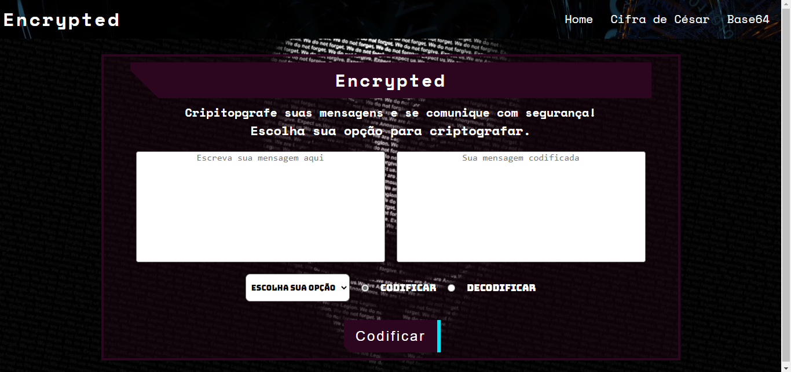

<h1>Criptografe-Mensagem-Oculta 🔒<h1> 
 
 <strong>Encrypted</strong> ✅
<h1>Sumario</h1>

- [Sobre](#sobre)
- [Requisitos](#requisitos)
  - [Cifra de Cesár](#cifra-de-cesár)
  - [Base64](#base64)
- [Documentações e Referências](#documentações-e-referências)
- [Layout](#layout)
- [Teste aqui](#teste-aqui)
- [Tecnologias](#tecnologias)

# Sobre
<h3> Projeto proposto pela Resilia Educação no módulo 2. A aplicação consiste em um codificador/decodificador de cifra de césar e base64 </h3>
<hr>

# Requisitos
- Crie um formulário que receberá dados para codificar e decodificar uma mensagem utilizando cifra de césar e base64 , seu formulário deve conter:
  - [X] Um campo de entrada da mensagem do tipo texto.
  - [x] Um campo de seleção com as opções cifra de césar de base64. 
  - [X] Quando cifra de césar estiver selecionado, um outro campo deve surgir no formulário, no qual o incremento utilizado na cifrá deverá ser informado.
  - [x] Duas entradas radias[radios-buttons] com o textos: "codificar" e "decodificar"
  - [X] Um botão que com codificar selecionado exiba o texto do botão "codificar" e com decodificar selecionado exiba "decodificar" 
<hr>

## Cifra de Cesár

Em criptografia, a Cifra de César, também conhecida como cifra de troca, código de César ou troca de César, é uma das mais simples e conhecidas técnicas de criptografia. É um tipo de cifra de substituição na qual cada letra do texto é substituída por outra, que se apresenta no alfabeto abaixo dela um número fixo de vezes. Por exemplo, com uma troca de três posições, A seria substituído por D, B se tornaria E, e x
  
  - <h2>Curiosidade</h2>
  <br>
  
```
  O Imperador Julio Cesar teria criado um sistema de substituição mais elaborado do que simplesmente trocando as letras romanas por gregas, ele teria deslocado as letras do alfabeto e substituindo cada letra pela outra deslocada O nome do método é em homenagem a ele, que o usou para se comunicar com os seus generais.
```
<hr>

##  Base64

O Base64 é um método muito utilizado na internet para a codificação de dados, permitindo a transferência desses dados na forma de texto. Esse método pode ser utilizado para diversas finalidades na internet, sendo a principal delas a codificação para transferência. Além disso, esse método está presente em diversas transferências realizadas no dia a dia ao enviar um pacote de dados ou receber em um computador. Esse método de codificação é utilizado principalmente em transferências onde é necessário que os dados contenham texto em vez de números binários. Nesse tipo de codificação, o Base64 permite que os dados sejam convertidos para texto, permitindo uma transferência mais completa e adequada para cada sistema. 

 -  <h2>Curiosidade</h2>
  <br>
  
-> <strong>Origem do nome</strong> <-

```
Inicialmente, o algoritmo foi nomeado como “printable encoding” e somente após alguns anos, em Junho de 1992, a RFC definiu como Base64. E o sufixo 64 se deve ao fato do algoritmo ser baseado em 64 carácteres (64 basic characters).
```

# Documentações e Referências

Algumas documentações e sites que consultei durante o processo de desenvolvimento do projeto

[Consultei para aprender como o input do tipo ranger funciona](https://developer.mozilla.org/pt-BR/docs/Web/HTML/Element/input/range
)

[Consultei para aprender como mostrar o valor do input do tipo ranger](https://pt.stackoverflow.com/questions/138489/como-fa%C3%A7o-para-mostrar-o-value-do-input-type-range
)

[Consultei para aprender como estilizar o input do tipo ranger](https://desenvolvedor-web.blogspot.com/2018/02/colocar-estilo-no-input-ranger.html
)

[Consultei para aprender como funciona o método btoa()](https://developer.mozilla.org/en-US/docs/Web/API/btoa#examples
)


# Layout



<br>

# Teste aqui 

   https://shiellynferr.github.io/Criptografe-Mensagem-Oculta/

#  Tecnologias

As seguintes tecnologias foram utilizadas nesse projeto

- [Html](https://developer.mozilla.org/pt-BR/docs/Web/HTML)
- [Css](https://developer.mozilla.org/pt-BR/docs/Web/CSS)
- [Javascript](https://developer.mozilla.org/pt-BR/docs/Web/JavaScript/Guide/Introduction)

<hr>
  
 > Made with 💙 by Shiellyn Ferreira [See my Linkedin](https://www.linkedin.com/in/shiellyn-ferreira/)

